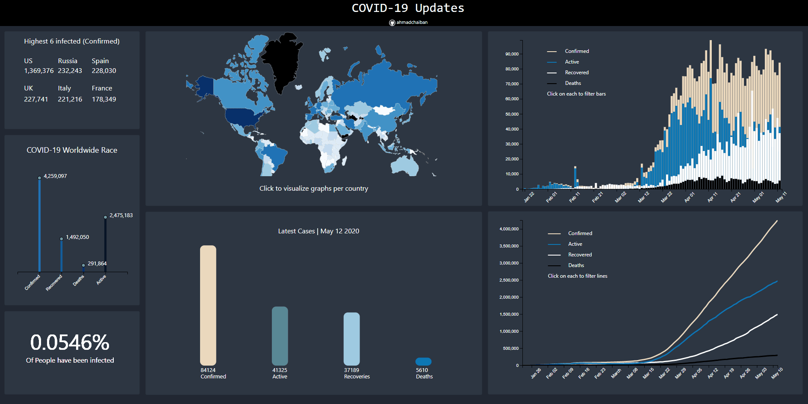

# COVID-19 Data Dashboard

## Introduction:

I built this dashboard to give peope some detailed insight on the spread and management of COVID-19. It was also a great tool that furthered my d3.js visualization skills. 
The data was processed in Python scripts that run every hour. Currently, the website runs on an Amazon EC2 server. 

Visit on www.covidemic.org

It is composed of 7 graphs: 

1. The Top 6 confirmed cases
2. COVID-19 Worldwide race
3. Percentage of the world infected
4. The World Heat Map
5. Daily latest cases
6. Confirmed/Active/Recovered/Deaths per day (Top right histogram)
7. Total number of Confirmed/Active/Recovered/Deaths aggregated per day (Bottom right Line Graph)

<!--  -->

## Usage: 

The dashboard has some static functionalities (which will be changed in the future) and some other dynamic ones. The user can zoom in and highlight on the main world map accordingly:

  
<!--  -->

This can either be done by tapping (on mobile), or hovering with your mouse. Moreover, upon clicking/tapping on any country, **all graphs** can be visualized by country: 

  

<!--  -->

<!--  -->

Here the user can also toggle the lines/Bars they want to see by clicking on the Legend Text. 

  

<!--  -->

Tapping/clicking the reset button will allow the user to return to the worldwide view of the graphs 

<!--  -->

## Mobile View (iphone 11):

The following is a mobile preview of the dashboard. It has all the same functionalities as the desktop version. 

## Technical files: 

### Data:

Main Data Source: https://github.com/pomber/covid19

This repo provided the main data that I later did my aggregations and other processing on. See the following files:

1. **DataFetchers/dataFetch.py**
2. **DataFetchers/Agg_data.py**

They are being executed per hour on the EC2 server.
Please run dataFetch.py in order to retrieve the data required from the data source. 

### D3.js files

The following files are used to visualize the graphs: 

1. **d3 js files/heatMap.js** displays the main heat map. 
2. **d3 js files/worldRace.js** renders the COVID-19 Worldwide Race graph. 
3. **d3 js files/top_6_worldwide.js** displays the top 6 confirmed cases worldwide graph. 
4. **d3 js files/percentInfo.js** shows the percent of the world that has been infected. 
5. **d3 js files/LatestCases.js** displays today's cases worldwide. 
6. **d3 js files/countrySpecificHist.js** is for the top right histogram per day. 
7. **d3 js files/lineGraphDaily.js** is the file that shows the aggregated line graph. 

**d3-tip.js** is used for the map highlights.

Hope you find this project useful! 

### Upcoming Features: 

1. Search Bar (?)
2. Transitions between graph switches

